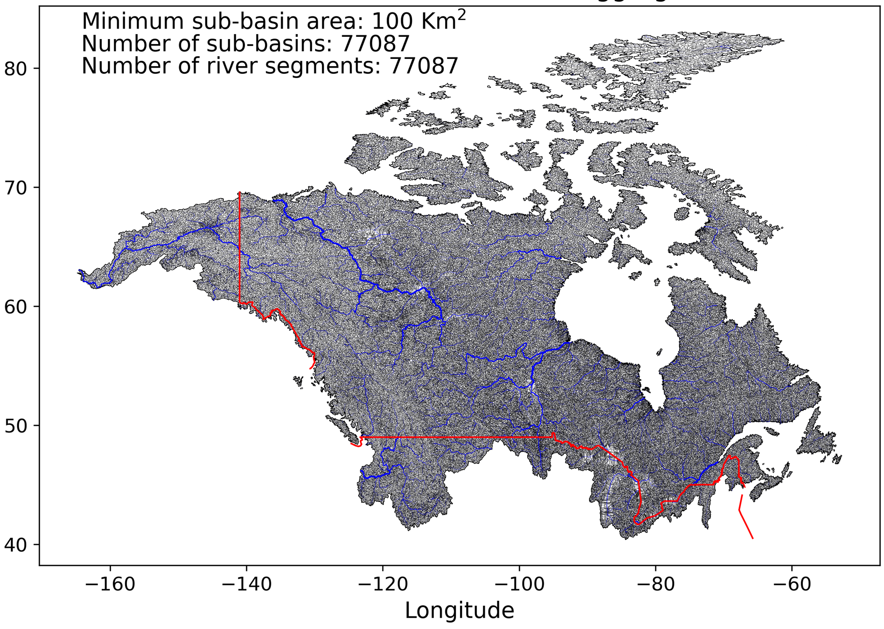

# National Adaptation Strategy (NAS) Project – MESH Model Setup

---
## National Adaptation Strategy (NAS) – Hydrological Modeling

This repository contains the initial hydrological modeling setup and metadata for the National Adaptation Strategy (NAS) project led by Environment and Climate Change Canada (ECCC). The project aims to support climate resilience by generating large-scale hydroclimate data and modeling future water availability across Canada's transboundary river basins using the MESH hydrological model.

Key preliminary outputs include historical simulations of streamflow, evapotranspiration, soil moisture, and snow water equivalent. These results form the foundation for assessing future climate change impacts on water resources in Canada’s transboundary basins.

## Project objective and Scope

The objective of this project is to generate accurate, regional-scale projections of hydroclimate variables under various climate change scenarios. Using the MESH hydrological model, the initial phase simulates surface water processes such as streamflow and evapotranspiration across Canada’s transboundary basins.

This repository includes the initial model setup using historical climate data and presents preliminary outputs to support assessments of streamflow prediction.

---

## Study Domain and Dataset

The study domain encompasses all of Canada’s river basins, including **Transboundary River Basins (CanTrans)** that span the Canada–United States border.

Key transboundary systems include:

- Columbia River Basin
- Yukon River Basin
- Mackenzie River Basin
The domain reflects the geographical and hydrological diversity of Canada's river systems, emphasizing those of binational importance. A map of the river basins is provided below.

  
*Figure 1: Canada's river basins and transboundary systems*

---
## Model Cases and Repository Setup

This repository includes multiple configurations (based on the Model run configuration sequencing strategy) of the MESH hydrological model as part of the initial NAS project analysis:

- **Lap0_Base_case_0_0** – Uncalibrated parameters (baseline)
- **Lap0_Base_case_0_01** – GRU-based parameterization
- **Lap0_Base_case_0_02** – Distributed parameterization

Each case includes:
- Configuration files for MESH
- Metadata file

