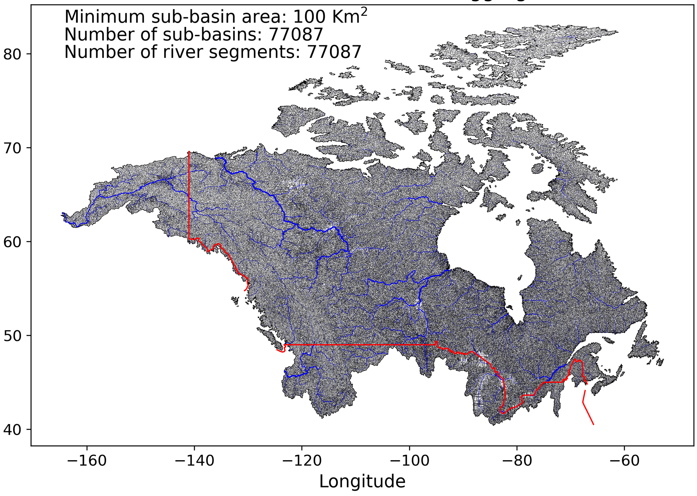

# National Adaptation Strategy (NAS) Project – MESH Model Setup
---
## National Adaptation Strategy (NAS) – Hydrological Modeling

This repository contains the initial hydrological modeling setup and metadata for the **National Adaptation Strategy (NAS)** project led by **Environment and Climate Change Canada (ECCC)**. The project aims to support climate resilience by generating large-scale hydroclimate data and modeling future water availability across Canada's transboundary river basins using the MESH hydrological model.

The repository includes model configurations, metadata, and preliminary outputs from historical and climate-change simulations using the **MESH hydrological model**. Key preliminary outputs include historical simulations of streamflow, evapotranspiration, soil moisture (at different soil depths), runoff and snow water equivalent. These results form the foundation for assessing future climate change impacts on water resources in Canada’s transboundary basins.

## Project objective and Scope

The objective of the NAS hydrological modeling project is to produce credible, regional-scale projections of future water availability across Canada under multiple climate scenarios.
Key components include:

- Continental-scale MESH simulations across all Canadian and transboundary river basins

- Historical forcing using CaSR v2.1 and CaSR v3.1 datasets

- Climate-change simulations using CMIP6 global climate models (e.g., CanESM5)

- Evaluation of streamflow, evapotranspiration, snow processes, soil moisture, and runoff

These outputs support federal, provincial, and cross-border water-management planning.

---

## Study Domain and Dataset

The study domain encompasses all of Canada’s river basins, including **Transboundary River Basins (CanTrans)** that span the Canada–United States border.

Key transboundary systems include:

- Columbia River Basin
- Yukon River Basin
- Mackenzie–Peace–Liard Basin
- St. Mary–Milk River Basin
- Red–Assiniboine River Basin
- Great Lakes–St. Lawrence Basin
  
The domain reflects the geographical and hydrological diversity of Canada's river systems, emphasizing those of binational importance. A map of the river basins is provided below.

  
*Figure 1: Canada's river basins and transboundary systems*

---
## Model Cases and Repository Setup

This repository includes multiple configurations (based on the **Model run configuration sequencing strategy** spreadsheet) of the MESH hydrological model as part of the initial NAS project analysis:

- **Lap_0** - Model Agnostic Framework (MAF) model setup
  Baseline hydrological framework for establishing the national MESH domain.
- **Lap_1** - Out-of-box parameter MESH runs on version 1860_ME_ZT
	- **Iterations 1.01–1.03** - Uncalibrated MESH runs using CaSR v2.1 and CaSR v3.1 forcing
	- **Iterations 1.04–1.09** - Initial climate-change simulations on the benchmark basin using CMIP6 (CanESM5)
- **Lap_2** - Parameters estimation from available data [MODIS LAI, Soil, DD, SDep]
	- **Iterations 2.01–2.06** - Lumped/distributed MESH runs using CaSR v2.1 and CaSR v3.1
	- **Iterations 2.07–2.11** - Climate-change simulations for the full Canada and transboundary domain using CMIP6 (CanESM5)
  
## Each iteration folder contains:

- MESH configuration files
- Metadata and Readme file

## Project Team

- Zelalem Tesemma, Environment and Climate Change Canada (zelalem.tesemma@ec.gc.ca)
- Sujata Budhathoki, Environment and Climate Change Canada (sujata.budhathoki@ec.gc.ca)
- Frank Seglenieks, Environment and Climate Change Canada
- Bruce Davison,Environment and Climate Change Canada
- Riley Damen, Environment and Climate Chnage Canada

## Disclaimer
This is an active research repository. Model configurations, parameters, and outputs are subject to change as improvements are made. Please contact the project team before using this material for publications or decision-making applications.

